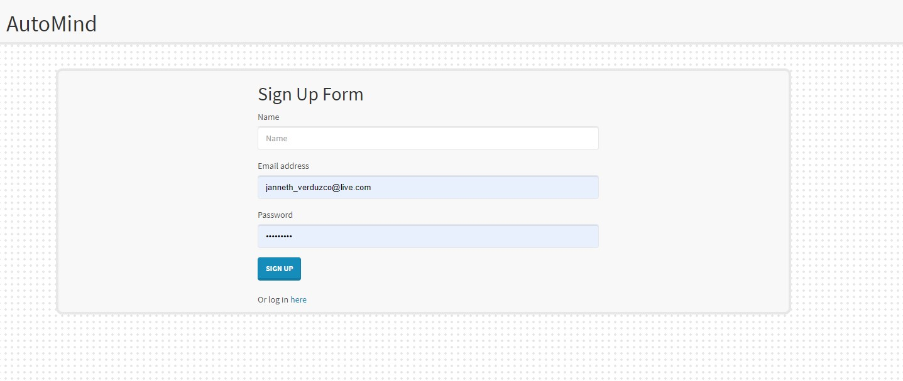
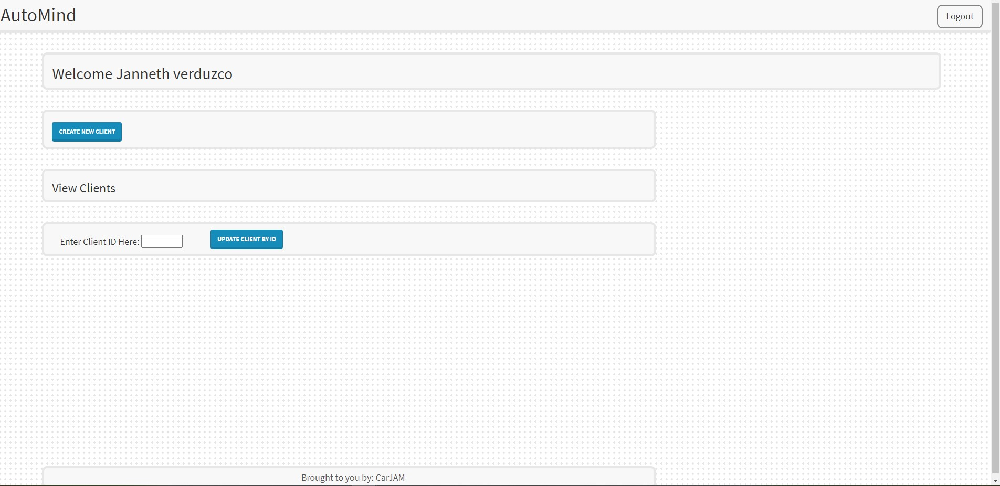
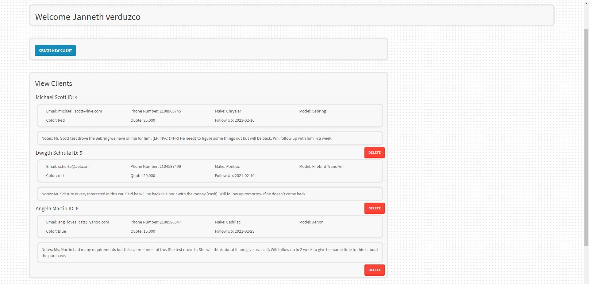
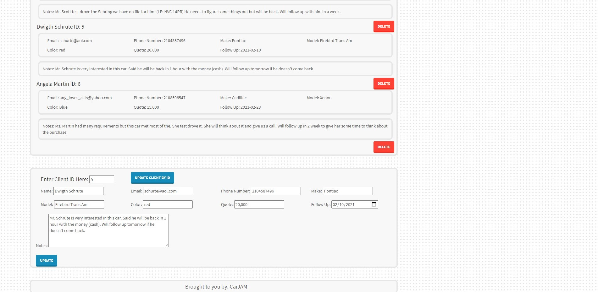

# AutoMind [](https://opensource.org/licenses/MIT)

## Table of Contents
  * [Description](#Description)
  * [User Story](#User-Story)
  * [Elevator Pitch](#Elevator-Pitch)
  * [Contributors](#Contributors)
  * [Language/Technoligies Used](#Language/Technologies-Used)
  * [Mock-Up](#Mock-Up)    
  * [Repository](#Repository-Link)


## Description 
AutoMind is an interactive application for car salesman to help keep ongoing client interaction organized. The salesman can create a secure account using name, email and password to then be taken into the main page where the clients are listed. The clients can be specifically viewed to update notes or update preferences or a call they are looking to buy. If clients are no longer interested there is also an option to delete the specific client.

## User Story
```
AS A sales person

I WANT to be able  to keep tack, update, and delete clients inforamtion and interaction

SO THAT when I follow up with a client, I have an organized history of notes and client information
```
## Elevator Pitch
```
If you need to stay organized with your clients or future prospects this app will allow you to keep track of notes and personal client information with proper authentication, it will also help keep organized by allowing to set follow ups with clients. 
```
## Contributors
* [Alex Bertuzzi](https://github.com/AlexBertuzzi) - alexmichaelbertuzzi@yahoo.com
* [Janneth Alvarado Verduzco](https://github.com/jannverduzco) - janneth_verduzco@live.com
* [Moussa Nait Merabet](https://github.com/Mnm1506) - moussanm2014@gmail.com

## Language/Technologies Used
* HTML
* CSS
* JavaScript
* jQuery
* NPM package(Package.json)
   * Express
   * mySql
   * Express-Handlebars
   * Passport
   * bcrypt
   * fs(file system)
   * Sequelize
   * Path

* Bootstarp (CSS framework)
* Basnal-io
(CSS Pattern library)

* Heroku (Deployment)
* Travis CI (Testing)
* ESLint (Testing code)

## Mock-Up 

### AutoMind (Website-SignUp)


### Dashboard Display


### Added Clients View


### Updating Client Information


## Live Link (Heroku)
### https://auto-mind.herokuapp.com/
Enter following credentials to view deployed site with data
email: bob_vance@yahoo.com
password: Password12
Or create your own account

https://auto-mind.herokuapp.com/

## Repository Link
### https://github.com/jannverduzco/AutoMind
